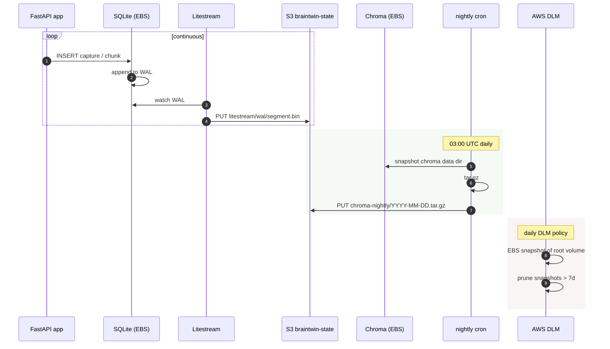

# Flow — Backup + restore drill (M.5 success criterion)

The phase 4.0.6 milestone "Litestream restore drill done with recorded
timings" is satisfied by walking through this flow on a fresh EBS
volume and writing the elapsed time into
`docs/phase4.0.6-deployment-smoke-test.md`.

## What gets backed up

| Source | Mechanism | Destination | Cadence | RPO |
|--------|-----------|-------------|---------|-----|
| SQLite (captures + chunks) | Litestream WAL replication | `s3://braintwin-state/litestream/` | continuous (seconds) | ~seconds |
| Chroma vector index | nightly cron `tar.gz` upload | `s3://braintwin-state/chroma-nightly/<date>/` | daily 03:00 UTC | 24h |
| Whisper / embedder models | re-pulled on instance bring-up | n/a (rebuildable) | — | n/a |
| EBS volume | DLM snapshot lifecycle | EBS snapshot store | daily, 7-day retention | 24h |
| Captured images | direct PUT during capture | `s3://braintwin-state/images/` | per-capture | 0 |

## Backup flow (steady state)



## Restore flow (drill / disaster)

```mermaid
sequenceDiagram
    autonumber
    participant Op as Operator (SSM)
    participant EC2 as Fresh EC2
    participant EBS as New EBS volume
    participant S3 as S3 braintwin-state
    participant LS as Litestream
    participant SQL as SQLite
    participant Chr as Chroma
    participant App as FastAPI app

    Op->>EC2: cdk deploy (or attach existing volume)
    EC2->>EBS: mount /data
    Op->>LS: litestream restore -o /data/braintwin.db \
        s3://braintwin-state/litestream/braintwin.db
    LS->>S3: list WAL segments
    LS->>EBS: replay WAL → SQLite
    Note over EBS,LS: ⏱ record elapsed time here

    Op->>S3: aws s3 cp chroma-nightly/<latest>.tar.gz /tmp/
    Op->>EBS: tar xzf /tmp/chroma.tar.gz -C /data/chroma/
    Note over EBS: ⏱ record elapsed time here

    Op->>App: docker compose up -d
    App->>SQL: opens /data/braintwin.db
    App->>Chr: opens /data/chroma/
    App-->>Op: /health 200

    Op->>Op: smoke test: /recall on a known query<br/>and compare results to pre-disaster
    Op->>Op: ✏ write RPO/RTO timings into<br/>phase4.0.6-deployment-smoke-test.md
```

## Acceptance for M.5

The phase 4.0.6 design doc says the drill is done when:

1. A fresh EC2 + EBS pair restores to a healthy `/recall` response
2. The exact wall-clock time for **WAL restore** and **Chroma tar
   restore** is recorded
3. The smoke-test doc has these numbers written down (operator gets a
   number for "how long is my disaster?")

## What this drill does NOT test

- Multi-region failover (deferred — see §3.0 of the deployment design)
- ECR outage during restore (we'd need the image already present)
- Lost S3 bucket entirely (deferred to Phase 5+ — would need
  cross-region replication or Glacier vaulting)
